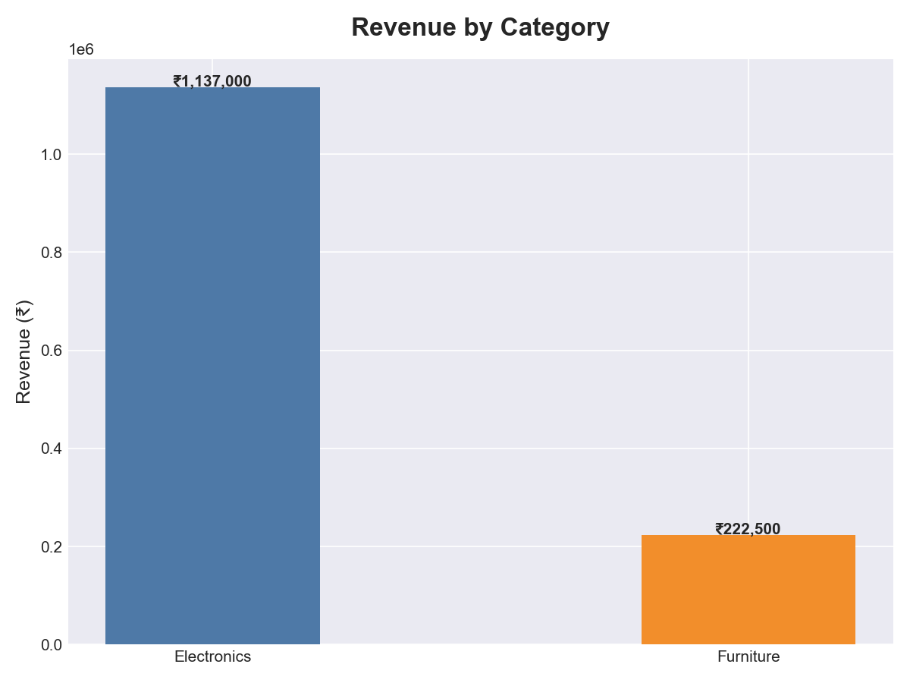
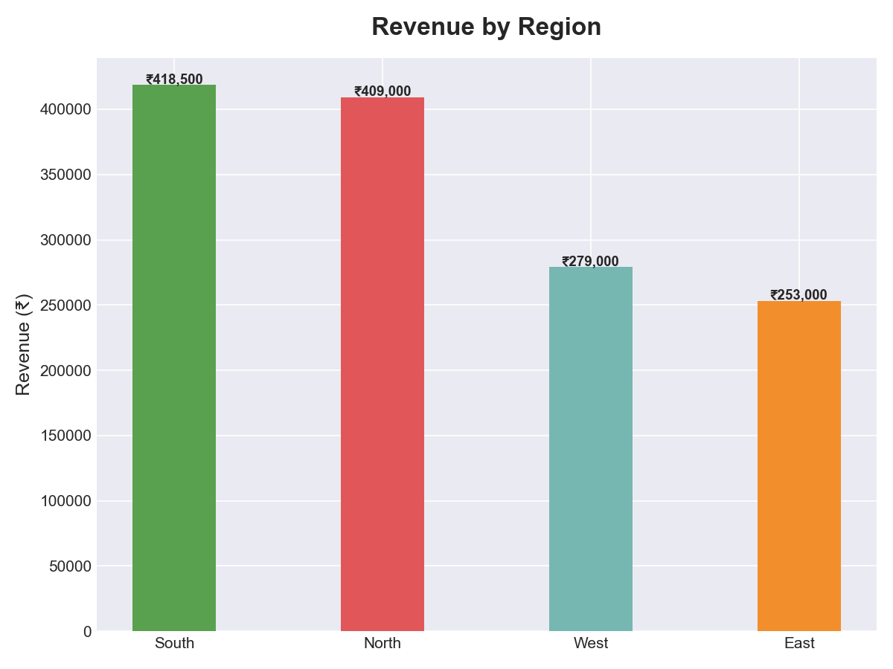
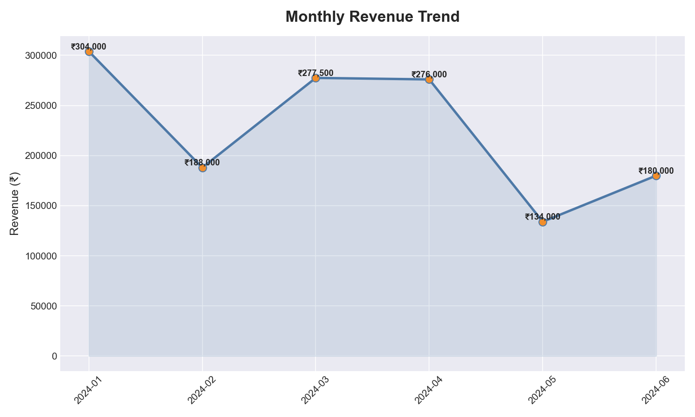
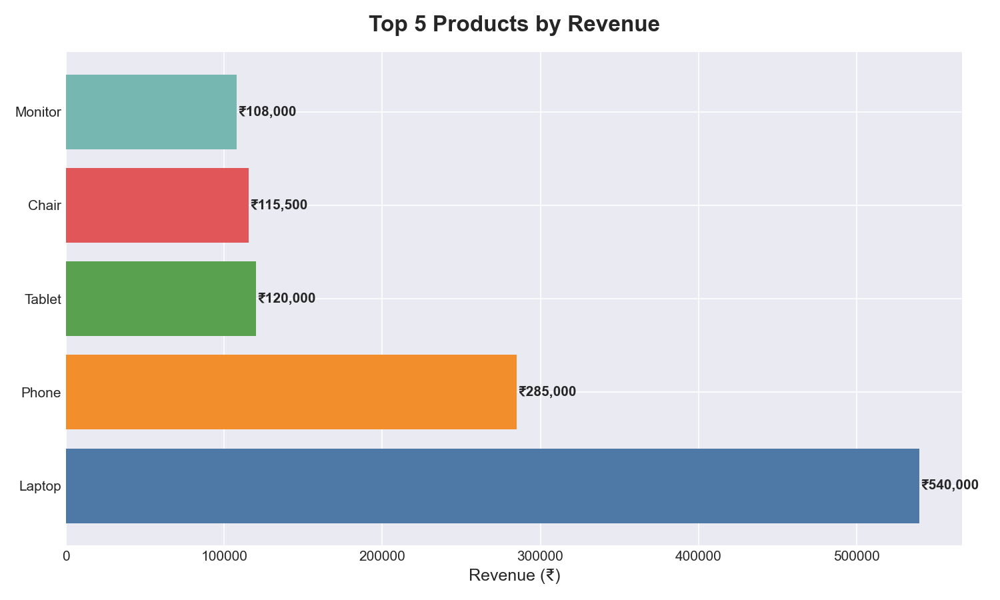

# 🛒 Sales Data Analysis

A data analysis project using Python, SQL (SQLite), and Pandas to analyze sales performance across products, regions, and months.

## 🔍 What This Project Does

- Loads sales data into a SQLite database
- Runs SQL queries to extract business insights
- Analyzes revenue by category, region, and product
- Tracks monthly revenue trends
- Generates 4 visualizations using Matplotlib

## 📈 Key Findings

- **Total Revenue:** ₹13,59,500
- **Top Category:** Electronics (₹11,37,000)
- **Best Region:** South (₹4,18,500)
- **Top Product:** Laptop (₹5,40,000 — 12 units sold)
- **Best Month:** January 2024 (₹3,04,000)

## 📊 Charts

### Revenue by Category


### Revenue by Region


### Monthly Revenue Trend


### Top 5 Products


## 🛠️ Tools Used

- Python 3.13
- Pandas — data manipulation
- SQLite3 — SQL queries and database
- Matplotlib — data visualization
- CSV — raw data storage

## 🚀 How to Run

1. Clone this repo
2. Install requirements:
   ```
   pip install pandas matplotlib
   ```
3. Run the analysis:
   ```
   python analysis.py
   ```

## 📁 Project Structure

```
sales-analysis/
│
├── sales.csv                  # Raw sales data
├── sales.db                   # SQLite database
├── analysis.py                # Main analysis script
├── revenue_by_category.png    # Chart 1
├── revenue_by_region.png      # Chart 2
├── monthly_revenue.png        # Chart 3
└── top_products.png           # Chart 4
```

## 👩‍💻 Author
Rajitha Reddy Bandari — [GitHub](https://github.com/rajitha150498)
